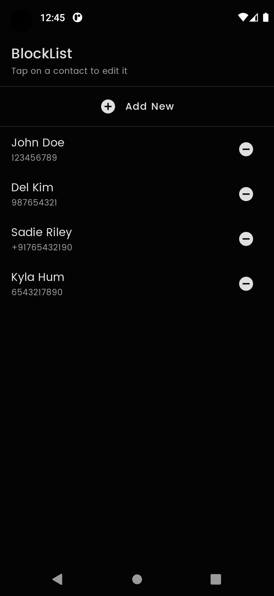
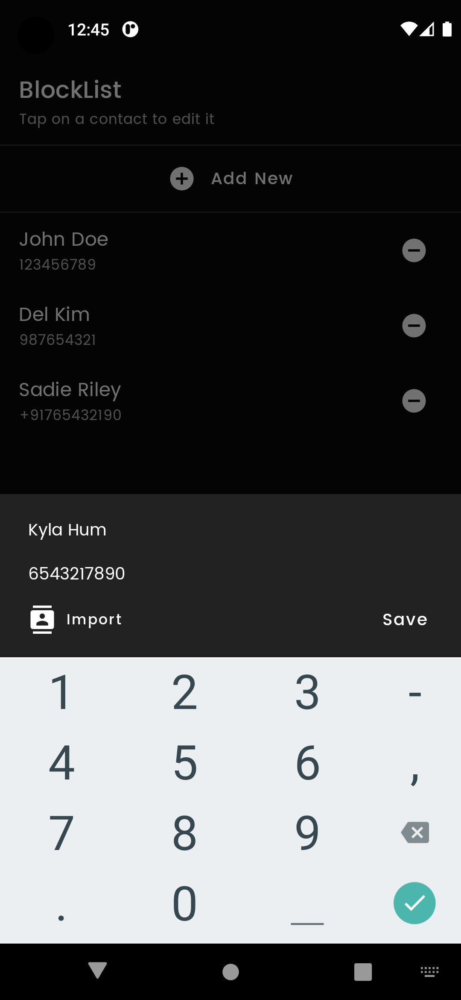

# CallBlocker-Android
Android app to block incoming calls from selected numbers

Implemented for an assignment. Only works on devices below API 29 for now.

## Screenshots
 

## Libraries
* [Jetpack Compose](https://developer.android.com/jetpack/androidx/releases/compose)
* [Navigation Compose](https://developer.android.com/jetpack/androidx/releases/navigation)
* [Room](https://developer.android.com/jetpack/androidx/releases/room)
* [Dagger Hilt](https://dagger.dev/hilt/)
* [Accompanist](https://github.com/chrisbanes/accompanist)
